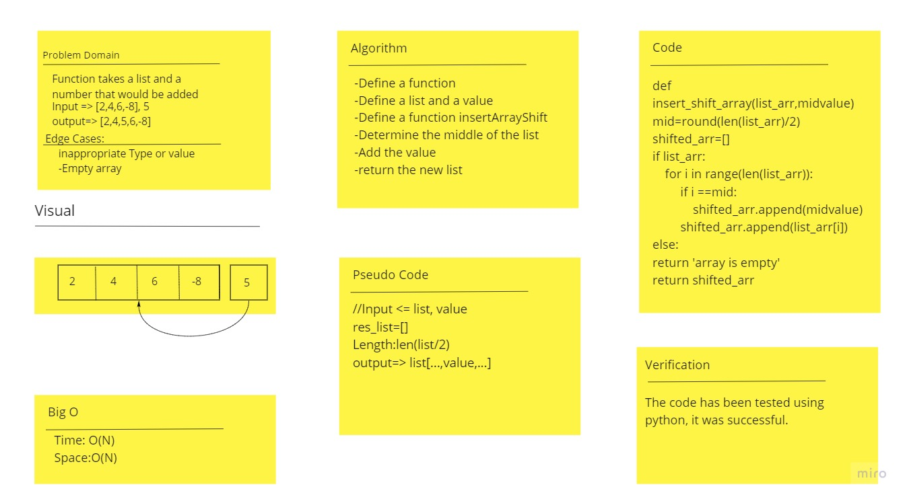

# Code Challenge: InsertShiftArray
Write a function called insertShiftArray which takes in an array and a value to be added. Without utilizing any of the built-in methods available to your language, return an array with the new value added at the middle index.

# Approach & Efficiency

* Approach: I used a for in loop that iterates the elements. Then, insert/add using the .append function
* Efficiency: O(N), where n is the number of elements in the array.

# Whiteboard:

