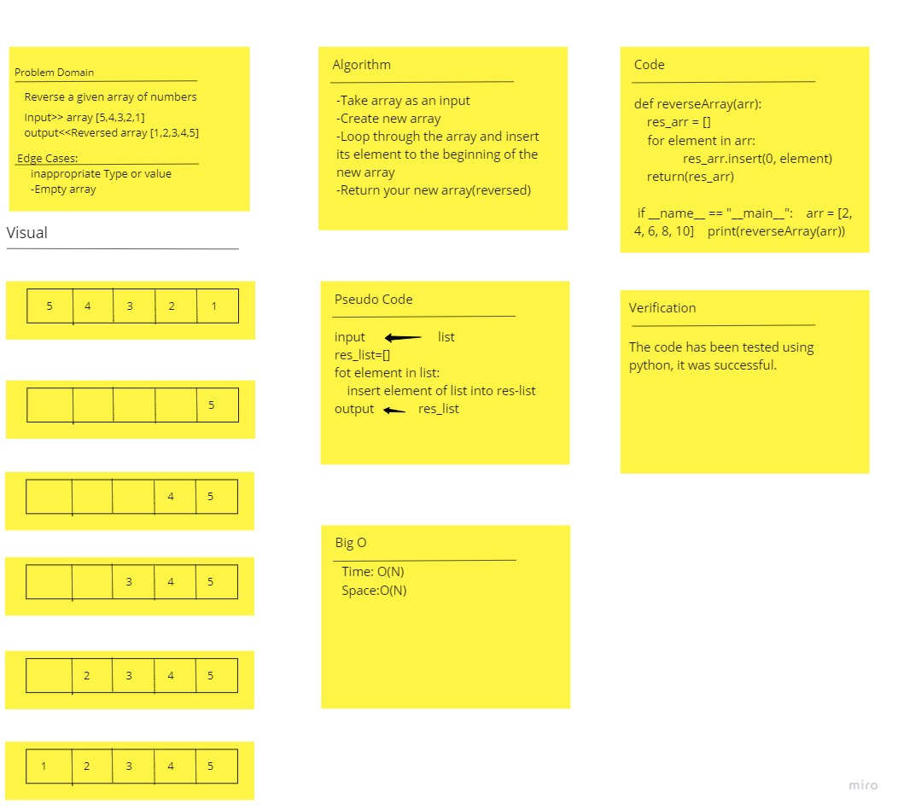

# Code Challenge: Reverse an Array
Write a function called reverseArray which takes an array as an argument. Without utilizing any of the built-in methods available to your language, return an array with elements in reversed order.

# Approach & Efficiency

Approach: I used a for in loop that iterates the elements. Then, insert/add using the .insert function
Efficiency: O(N), where n is the number of elements in the array.

# Whiteboard:

