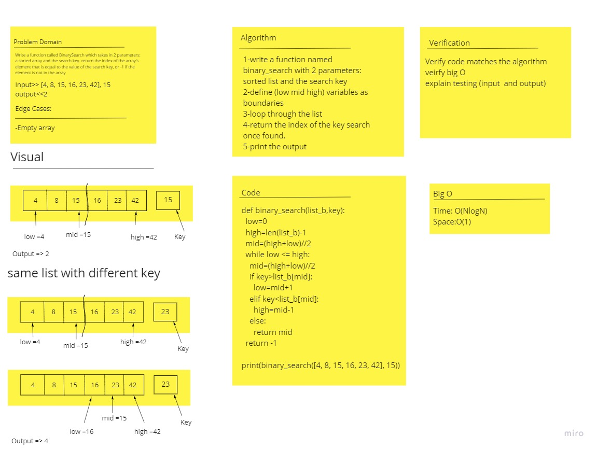

## Code Challenge: Binary Search
Write a function called BinarySearch which takes in 2 parameters: a sorted array and the search key. Without utilizing any of the built-in methods available in Python, return the index of the array’s element that is equal to the search key, or -1 if the element does not exist.

## Approach & Efficiency
* Approach: I used While loop to iterate through the list elements and search for an element index using the binary search method.
* Complexity: O(nlgn), where n is the number of elements in the array.

## Whiteboard:

