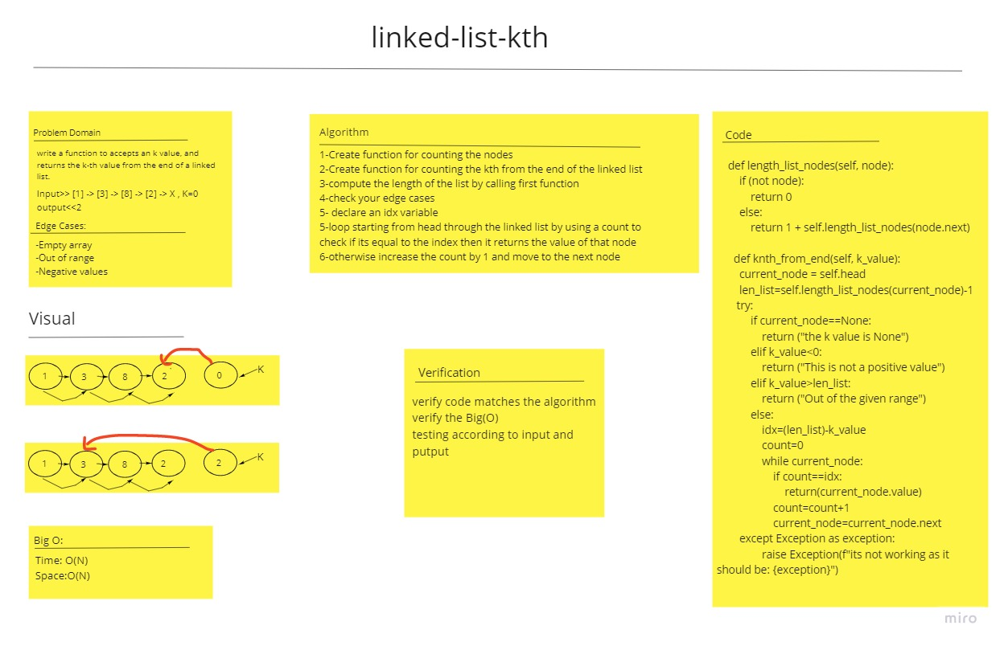

# Challenge Summary
kth from end of a linked list
Two functions one to mesure the length of the list and one to get the knth_from_end

## Whiteboard Process
<!-- Embedded whiteboard image -->

## Approach & Efficiency
<!-- What approach did you take? Why? What is the Big O space/time for this approach? -->
Two functions one to mesure the length of the list and one to get the knth_from_end
O(n) for space and time
## Solution
<!-- Show how to run your code, and examples of it in action -->
input :

    ll=Linkedlist()

    ll.insert(1)

    ll.insert(3)

    ll.insert(8)

    ll.insert(2)

    print(ll)

    # 2 -> 8 ->3-> 1

    print(ll.knth_from_end(-1))

    print(ll.knth_from_end(8))

    print(ll.knth_from_end(0))

    print(ll.knth_from_end(1))

    print(ll.knth_from_end(3))

    print(ll.knth_from_end(4))

    ll2=Linkedlist()

    ll2.insert(5)

    ll2.insert(6)

    ll2.insert(7)

    print(ll2)
output:

    (2) -> (8) -> (3) -> (1)-> None
    This is not a positive value
    The value you have is out of the given range
    1
    3
    2
    The value you have is out of the given range
    (7) -> (6) -> (5)-> None
    This is not a positive value
    6
    5
    The value you have is out of the given range

