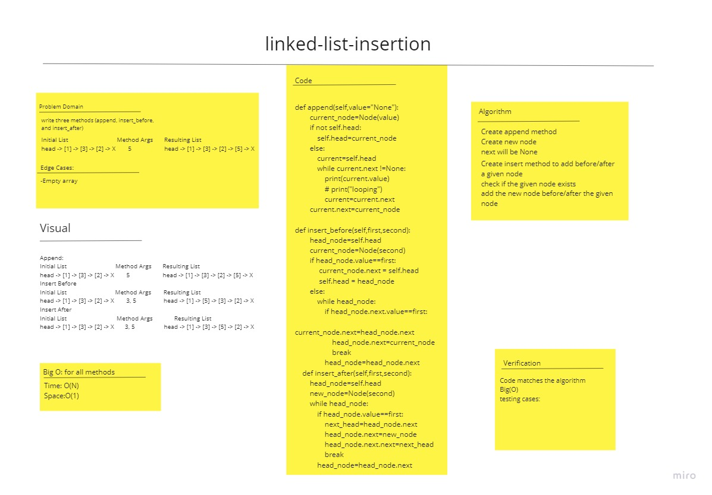

# Challenge Summary
<!-- Description of the challenge -->
Write the following methods for the Linked list

List class:

    append
            arguments: new value
            adds a new node with the given value to the end of the list
    insert before
            arguments: value, new value
            adds a new node with the given new value immediately before the first node that has the value specified
    insert after
            arguments: value, new value
            adds a new node with the given new value immediately after the first node that has the value specified

## Whiteboard Process
<!-- Embedded whiteboard image -->

## Approach & Efficiency
<!-- What approach did you take? Why? What is the Big O space/time for this approach? -->
space : O(1) time : O(n) for all methods
## Solution
<!-- Show how to run your code, and examples of it in action -->
1-Insert : add item to the linked list

2-append: add item tot he end of a linked list

3-Insert after: add item in a specific location

4-Insert before: add item in a specific location

